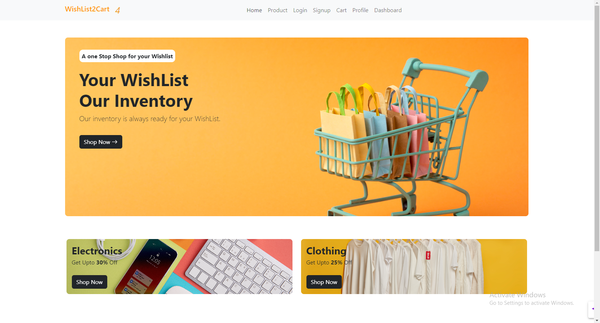
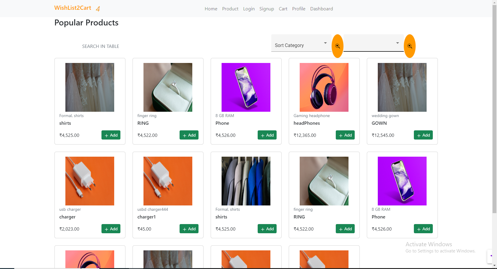
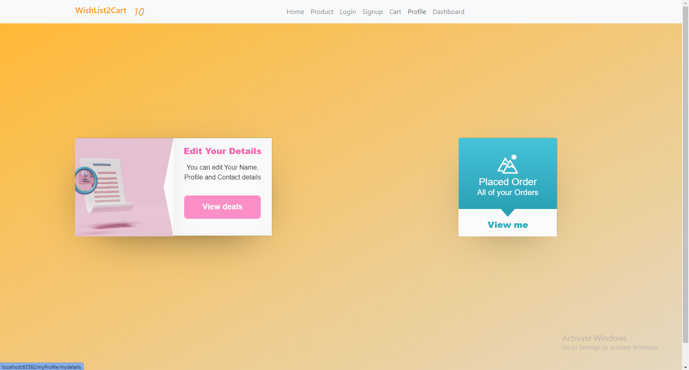
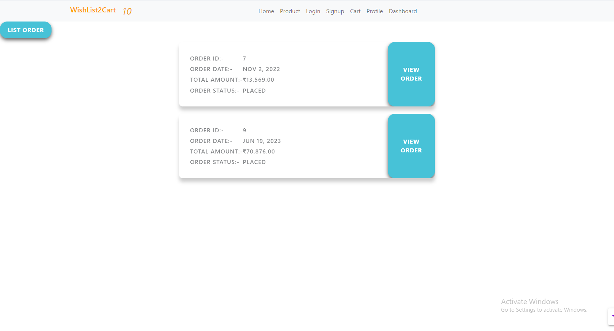
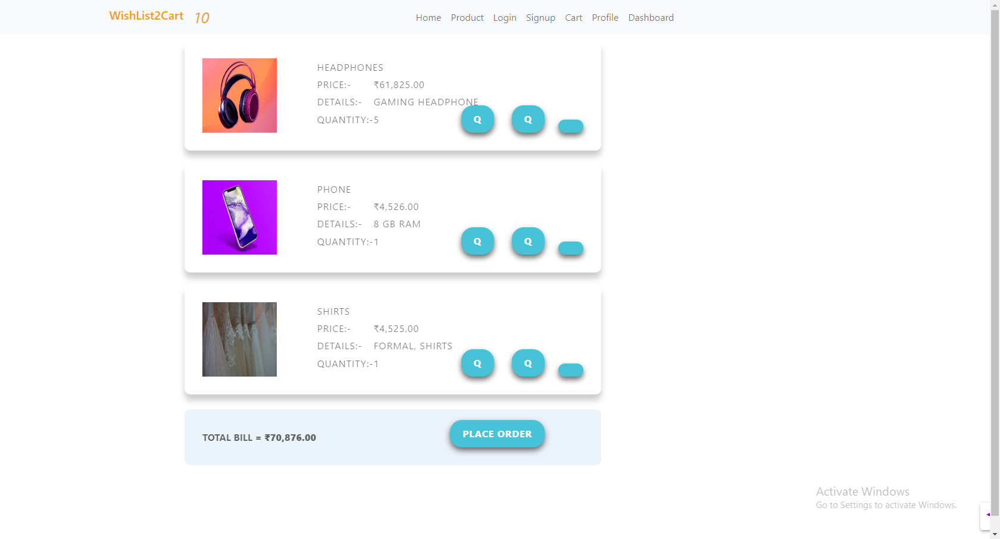
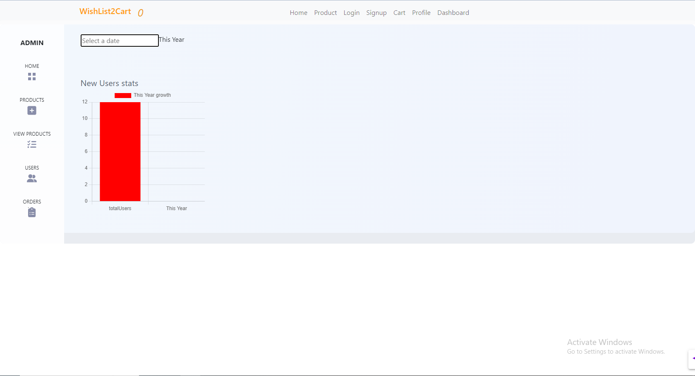
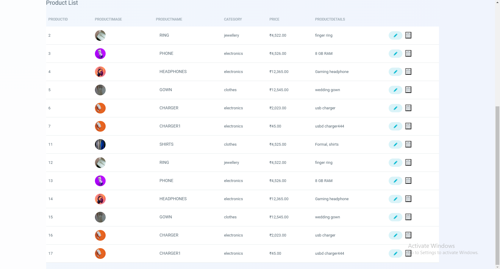

# W2c - Angular E-commerce Website and Admin Dashboard

This project is an e-commerce website and admin dashboard developed using Angular and MySQL. It provides a user-friendly interface for browsing products, managing orders, and an admin dashboard for managing the website's content.

## Screenshots

Here are some screenshots of the application:

### Homepage


### Product Page


### Profile Page


### My Orders Page


### Cart Page


### Admin Dashboard


### Product List in Admin Dashboard


## Development Server

To run the project locally, follow these steps:

1. Make sure you have the Angular CLI installed. This project was generated with Angular CLI version 14.2.2.
2. Clone the repository to your local machine.
3. Install the project dependencies by running `npm install` in the project directory.
4. Start the development server by running `ng serve`. The application will be available at `http://localhost:4200/`. It will automatically reload if you make any changes to the source files.

## Code Scaffolding

You can use Angular CLI to generate new components, directives, pipes, services, classes, guards, interfaces, enums, or modules. Run the following command to generate a new component: 

```
ng generate component component-name
```

For more information, refer to the [Angular CLI Overview and Command Reference](https://angular.io/cli) page.

## Build

To build the project, run the following command:

```
ng build
```

The build artifacts will be stored in the `dist/` directory.

## Running Unit Tests

You can execute unit tests using Karma test runner. Run the following command:

```
ng test
```

For more information, visit the [Karma](https://karma-runner.github.io) documentation.

## Running End-to-End Tests

To execute end-to-end tests, you need to add a package that implements end-to-end testing capabilities. Once added, run the following command:

```
ng e2e
```

Choose a platform of your choice for running the tests.

## Further Help

If you need more help on how to use the Angular CLI, you can run the following command:

```
ng help
```

You can also refer to the [Angular CLI Overview and Command Reference](https://angular.io/cli) page for more detailed information.

Feel free to explore the codebase and customize the application according to your requirements. Happy coding!
